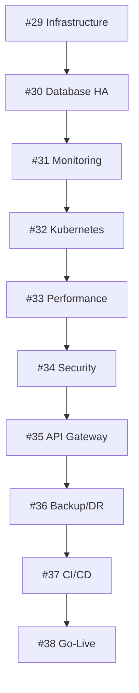

# GreenMetrics Production Launch Roadmap
## 10-PR Sequence for Production Deployment (#29-#38)

### 🎯 Overview
Systematic production deployment through 10 sequential PRs, each building on the previous foundation to create a robust, scalable, and secure platform.

---

## ✅ PR #29: Production Infrastructure & Secrets Bootstrapping
**Status: COMPLETED** | **Foundation Layer**

### Deliverables
- [x] Comprehensive environment configuration (200+ variables)
- [x] Environment validation tooling (`scripts/env-check.ts`)
- [x] Infrastructure automation (`scripts/infra-setup.ts`)
- [x] Multi-cloud provisioning support (AWS, Azure, GCP)
- [x] Security hardening and secrets management
- [x] Development workflow integration

### Technical Achievements
- Complete environment schema validation
- Automated infrastructure resource planning
- Production-grade security configurations
- Multi-environment support (dev/staging/production)

---

## 🚧 PR #30: Multi-Region Database & High Availability
**Status: PLANNED** | **Reliability Layer**

### Objectives
- Multi-region PostgreSQL replication setup
- Automated failover and disaster recovery
- Backup strategies and point-in-time recovery
- Database connection pooling optimization

### Technical Scope
```typescript
// Multi-region database configuration
const dbConfig = {
  primary: { region: 'us-east-1', size: 'db.r5.large' },
  replica: { region: 'us-west-2', size: 'db.r5.large' },
  backup: { retention: '30d', pitr: true },
  failover: { auto: true, timeout: '30s' }
}
```

### Deliverables
- [ ] Cross-region database replication
- [ ] Automated failover procedures
- [ ] Backup and recovery automation
- [ ] Performance monitoring and optimization

---

## 🚧 PR #31: Advanced Monitoring & Alerting
**Status: PLANNED** | **Observability Layer**

### Objectives
- Comprehensive monitoring stack deployment
- Custom metrics and business KPIs
- Intelligent alerting with escalation
- Performance dashboards and insights

### Technical Scope
```typescript
// Monitoring configuration
const monitoring = {
  metrics: ['application', 'infrastructure', 'business'],
  alerting: ['email', 'slack', 'pagerduty'],
  dashboards: ['operations', 'business', 'security'],
  retention: '90d'
}
```

### Deliverables
- [ ] Prometheus/Grafana stack deployment
- [ ] Custom application metrics
- [ ] Alert manager configuration
- [ ] Business intelligence dashboards

---

## 🚧 PR #32: Container Orchestration & Kubernetes
**Status: PLANNED** | **Scaling Layer**

### Objectives
- Kubernetes cluster setup and configuration
- Application containerization
- Auto-scaling and load balancing
- Blue-green deployment strategies

### Technical Scope
```yaml
# Kubernetes deployment configuration
apiVersion: apps/v1
kind: Deployment
metadata:
  name: greenmetrics-app
spec:
  replicas: 3
  strategy:
    type: RollingUpdate
  template:
    spec:
      containers:
      - name: app
        resources:
          requests: { cpu: 200m, memory: 512Mi }
          limits: { cpu: 500m, memory: 1Gi }
```

### Deliverables
- [ ] Kubernetes cluster provisioning
- [ ] Application Helm charts
- [ ] Auto-scaling policies
- [ ] Rolling deployment automation

---

## 🚧 PR #33: CDN & Performance Optimization
**Status: PLANNED** | **Performance Layer**

### Objectives
- Global CDN deployment and configuration
- Static asset optimization and caching
- Image optimization and delivery
- Performance monitoring and budgets

### Technical Scope
```typescript
// CDN and caching configuration
const cdn = {
  provider: 'cloudflare',
  caching: {
    static: '1y',
    api: '5m',
    html: '1h'
  },
  optimization: {
    images: 'webp/avif',
    js: 'minification + compression',
    css: 'critical css inline'
  }
}
```

### Deliverables
- [ ] CloudFlare CDN setup
- [ ] Asset optimization pipeline
- [ ] Performance monitoring
- [ ] Core Web Vitals optimization

---

## 🚧 PR #34: Security Hardening & Compliance
**Status: PLANNED** | **Security Layer**

### Objectives
- Advanced security controls implementation
- GDPR/SOC2 compliance automation
- Vulnerability scanning and remediation
- Security incident response procedures

### Technical Scope
```typescript
// Security configuration
const security = {
  compliance: ['GDPR', 'SOC2', 'CCPA'],
  scanning: ['SAST', 'DAST', 'dependency'],
  protection: ['WAF', 'DDoS', 'rate-limiting'],
  audit: ['access-logs', 'change-tracking']
}
```

### Deliverables
- [ ] Web Application Firewall (WAF)
- [ ] Automated security scanning
- [ ] Compliance reporting automation
- [ ] Incident response procedures

---

## 🚧 PR #35: API Gateway & Rate Limiting
**Status: PLANNED** | **API Layer**

### Objectives
- API gateway deployment and configuration
- Advanced rate limiting and throttling
- API versioning and documentation
- Third-party integration security

### Technical Scope
```typescript
// API Gateway configuration
const apiGateway = {
  rateLimit: {
    authenticated: '1000/hour',
    anonymous: '100/hour',
    premium: '10000/hour'
  },
  security: ['JWT validation', 'API key management'],
  monitoring: ['usage analytics', 'error tracking']
}
```

### Deliverables
- [ ] API Gateway deployment
- [ ] Rate limiting implementation
- [ ] API documentation automation
- [ ] Usage analytics and billing

---

## 🚧 PR #36: Backup & Disaster Recovery
**Status: PLANNED** | **Resilience Layer**

### Objectives
- Comprehensive backup strategies
- Disaster recovery automation
- Business continuity planning
- Recovery testing procedures

### Technical Scope
```typescript
// Disaster recovery configuration
const dr = {
  rto: '4 hours',      // Recovery Time Objective
  rpo: '15 minutes',   // Recovery Point Objective
  backup: {
    frequency: 'hourly',
    retention: '90d',
    testing: 'weekly'
  }
}
```

### Deliverables
- [ ] Automated backup systems
- [ ] Disaster recovery procedures
- [ ] Business continuity planning
- [ ] Recovery testing automation

---

## 🚧 PR #37: CI/CD Pipeline & Automation
**Status: PLANNED** | **DevOps Layer**

### Objectives
- Production-grade CI/CD pipeline
- Automated testing and quality gates
- Deployment automation and rollback
- Infrastructure as Code (IaC)

### Technical Scope
```yaml
# CI/CD Pipeline configuration
stages:
  - test: [unit, integration, e2e, security]
  - build: [docker, assets, documentation]
  - deploy: [staging, canary, production]
  - verify: [health, performance, rollback]
```

### Deliverables
- [ ] GitHub Actions production pipeline
- [ ] Automated quality gates
- [ ] Deployment automation
- [ ] Infrastructure as Code

---

## 🚧 PR #38: Go-Live & Launch Preparation
**Status: PLANNED** | **Launch Layer**

### Objectives
- Final production deployment
- Go-live procedures and checklist
- Post-launch monitoring and support
- Documentation and knowledge transfer

### Technical Scope
```typescript
// Launch readiness checklist
const launchReadiness = {
  technical: ['load testing', 'security audit', 'performance'],
  operational: ['runbooks', 'alerts', 'support'],
  business: ['pricing', 'onboarding', 'documentation']
}
```

### Deliverables
- [ ] Production deployment
- [ ] Go-live procedures
- [ ] Post-launch monitoring
- [ ] Support documentation

---

## 📊 Progress Tracking

### Completion Status
| PR | Title | Status | Dependencies | ETA |
|----|-------|--------|--------------|-----|
| #29 | Infrastructure & Secrets | ✅ COMPLETE | None | ✅ Done |
| #30 | Multi-Region Database | 🚧 PLANNED | #29 | Week 1 |
| #31 | Monitoring & Alerting | 🚧 PLANNED | #30 | Week 2 |
| #32 | Container Orchestration | 🚧 PLANNED | #31 | Week 3 |
| #33 | CDN & Performance | 🚧 PLANNED | #32 | Week 4 |
| #34 | Security & Compliance | 🚧 PLANNED | #33 | Week 5 |
| #35 | API Gateway | 🚧 PLANNED | #34 | Week 6 |
| #36 | Backup & DR | 🚧 PLANNED | #35 | Week 7 |
| #37 | CI/CD Pipeline | 🚧 PLANNED | #36 | Week 8 |
| #38 | Go-Live | 🚧 PLANNED | #37 | Week 9 |

### Critical Path Dependencies


### Risk Assessment
| Risk | Impact | Mitigation |
|------|--------|------------|
| Database Migration Complexity | High | Comprehensive testing in staging |
| Security Compliance Delays | Medium | Early security audit integration |
| Performance Bottlenecks | Medium | Load testing throughout development |
| Third-party Service Limits | Low | Backup providers and monitoring |

### Success Criteria
- [x] **PR #29**: Infrastructure foundation established ✅
- [ ] **PR #30**: Multi-region availability > 99.9%
- [ ] **PR #31**: < 5 minute incident detection
- [ ] **PR #32**: Auto-scaling under load
- [ ] **PR #33**: Core Web Vitals in green
- [ ] **PR #34**: Security audit passing
- [ ] **PR #35**: API rate limiting functional
- [ ] **PR #36**: DR testing successful
- [ ] **PR #37**: Zero-downtime deployments
- [ ] **PR #38**: Production launch successful

---

## 🎯 Launch Objectives

### Technical Goals
- **Availability**: 99.9% uptime SLA
- **Performance**: < 2s page load times
- **Security**: SOC2 Type II compliance
- **Scalability**: Handle 10x current load

### Business Goals
- **Customer Onboarding**: Seamless signup flow
- **Billing Integration**: Automated subscription management
- **Support**: Comprehensive self-service documentation
- **Compliance**: GDPR-ready data handling

### Operational Goals
- **Monitoring**: Real-time visibility into all systems
- **Alerting**: Proactive issue detection and resolution
- **Support**: 24/7 incident response capability
- **Documentation**: Complete operational runbooks

---

**Next Step**: Begin PR #30 implementation for multi-region database setup and high availability configuration.
